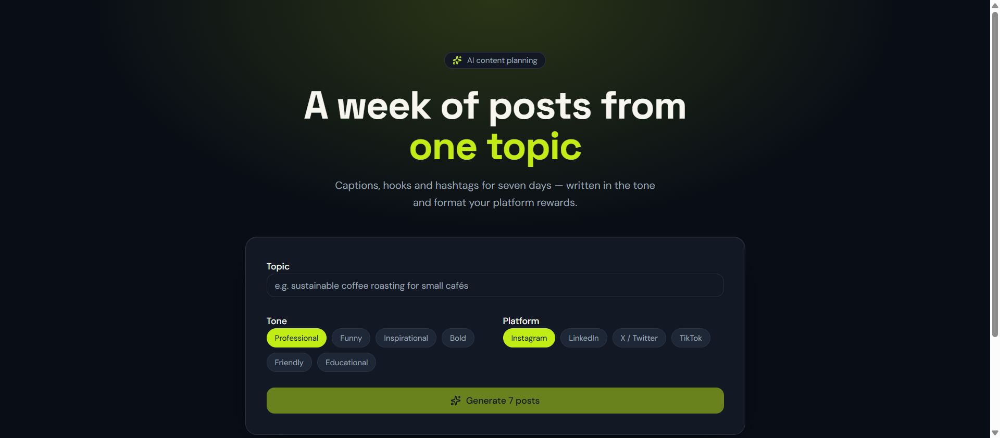

<p align="center">
  
</p>

<h1 align="center">✨ Social Spark AI</h1>

<p align="center">
  A week of ready-to-post social content from a single topic.
  <br/>
  <a href="https://social-spark-ai-fawn.vercel.app"><strong>Live demo →</strong></a>
</p>

<p align="center">
  
  
  
  
  
  
</p>

## The problem this solves

Posting consistently is the hardest part of building a personal brand, and most people burn out within two weeks. Opening a blank canvas and writing seven original posts across different platforms and tones is slow and drains creativity. Social Spark AI collapses that to one prompt: type a topic, pick a tone and a platform, and get seven days of hooks, captions, hashtags, and posting times you can ship immediately.

## Tech stack

- **Framework:** React 19 + TanStack Start (SSR, server functions) + TanStack Router/Query
- **AI:** Vercel AI SDK v7 with **structured output** (`Output.object` + Zod schema) against Google Gemini
- **Styling:** Tailwind CSS v4 + shadcn/ui
- **Deployment:** Vercel (Nitro preset)
- **Tooling:** TypeScript, ESLint, Prettier, Vite 8

## Key features

- **One topic → 7 posts** — a full week of daily content with hook, caption, hashtags, and best-time-to-post
- **6 tones × 4 platforms** — professional, funny, inspirational, bold, friendly, educational × Instagram, LinkedIn, X, TikTok
- **Guaranteed shape** — Zod-validated structured output, so the app renders exactly 7 valid posts or tells you the AI returned an unexpected format (no silent garbage)
- **One-click copy** — copy any post to the clipboard
- **Friendly failure modes** — clear messages for rate limits (429) and out-of-credits (402) instead of a crash

## How to run locally

```sh
git clone https://github.com/MK-OmniCode/social-spark-ai.git
cd social-spark-ai
npm install
npm run dev
```

Requires a `GEMINI_API_KEY`:

```sh
# .env.local
GEMINI_API_KEY=your_key_here
```

For production on Vercel, add `GEMINI_API_KEY` to your project's environment variables.

## What I'd improve next

- **Real posting-time data** — the "best time" is generated by the model, not derived from actual per-platform analytics; wiring real data would make it genuinely useful
- **Batch export** — CSV/Markdown export of the week's posts for scheduling tools
- **Tone memory** — learn a brand's voice over time and reuse it across sessions
- **Tests + CI** — the Zod schema is testable today and has zero coverage; the model-name fallback is hardcoded to a *preview* name that could disappear

---

Built by [Kashif](https://github.com/MK-OmniCode).
